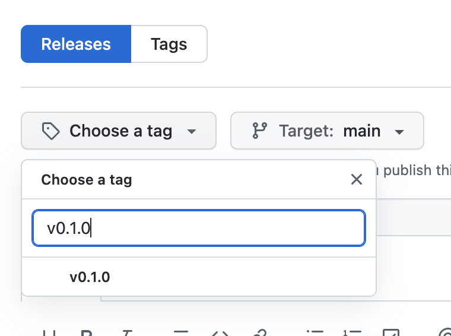

# RuboCop Sendoso

This repository provides recommended Rubocop configuration for use on Sendoso Ruby projects.

## Installation

Add this line to your application's Gemfile replacing the `tag` value with the most recent Github
tag:

```ruby
group :development do
  gem "rubocop-sendoso", github: "sendoso/rubocop-sendoso", tag: "vx.x.x", require: false
end
```

And then execute:

    $ bundle install


## Usage

First create a new file called `.rubocop.yml` in your root directory if it doesn't exist yet
and add the following to the top of `.rubocop.yml`
```
inherit_gem:
  rubocop-sendoso: config/default.yml
```

### Releasing

To release your gem

1. Go to [releases](https://github.com/sendoso/rubocop-sendoso/releases) and click "Draft a new release"


2. Choose or create a new tag. (See [versioning](#versioning))



3. Click "Generate Release Notes"


4. Finally click "Publish Release"


This will trigger an [action](https://github.com/sendoso/rubocop-sendoso/actions) that will
publish your gem for you automatically.

#### Versioning

The ruby gem version is based entirely off of the git tag in your release. Therefore, it is
important that the tag you create be named properly.

> Tags:
> * **MUST** start with "v"
> * **MUST** container major, minor, and patch number
>
> Examples:
> * v0.0.1
> * v0.1.0
> * v1.0.0

Sendoso uses [semantic versioning](https://semver.org/) to version gems (`<major>.<minor>.<patch>`).
The rule of thumb for incrementing versions is as follows:

| Version Bump | Description |
| ---- | ---- |
| Major | This release has breaking changes |
| Minor | This release contains a new feature that is backward compatible |
| Patch | This release has small fixes which are backward compatible |

-------

If you want to release a `non-production` version of your gem you can release using `rc` (release candidate).

For example if you'd like to release an `rc` version of your gem then create a release and name
the tag along the lines of:

```
v0.1.0.rc.1
```

## Contributing

Bug reports and pull requests are welcome on GitHub at https://github.com/sendoso/rubocop-sendoso. This project is intended to be a safe, welcoming space for collaboration, and contributors are expected to adhere to the [code of conduct](https://github.com/sendoso/rubocop-sendoso/blob/main/CODE_OF_CONDUCT.md).

### Submitting New or Updated Schemas

See https://github.com/sendoso/schemas#readme

## License

The gem is available as open source under the terms of the [MIT License](https://opensource.org/licenses/MIT).

## Code of Conduct

Everyone interacting in the Sendoso::Avro project's codebases, issue trackers, chat rooms and mailing lists is expected to follow the [code of conduct](https://github.com/sendoso/rubocop-sendoso/blob/main/CODE_OF_CONDUCT.md).
